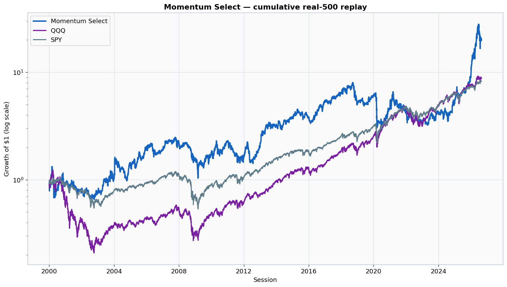
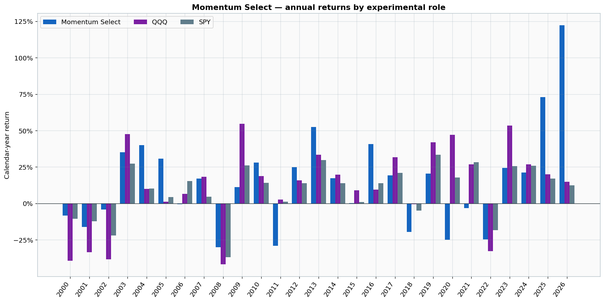

# Performance renders

The committed images are regenerated from the CSV files in `../data/` by running:

```bash
python scripts/render_reports.py
```

## Cumulative performance



## Annual returns



## Year-by-year results

| Year | Experimental role | Strategy | QQQ | SPY | Active vs QQQ |
|---:|---|---:|---:|---:|---:|
| [2000](../years/2000/) | Sealed test year | -8.29% | -39.31% | -10.58% | +31.02% |
| [2001](../years/2001/) | Unrevealed retrospective holdout | -16.13% | -33.56% | -12.30% | +17.43% |
| [2002](../years/2002/) | Unrevealed retrospective holdout | -4.09% | -38.41% | -22.14% | +34.32% |
| [2003](../years/2003/) | Partial training boundary | +35.05% | +47.55% | +27.29% | -12.50% |
| [2004](../years/2004/) | Training fit | +39.98% | +9.94% | +10.24% | +30.05% |
| [2005](../years/2005/) | Training fit | +30.64% | +1.13% | +4.23% | +29.50% |
| [2006](../years/2006/) | Training with validation boundary | -0.64% | +6.51% | +15.22% | -7.15% |
| [2007](../years/2007/) | Validation check | +16.92% | +18.21% | +4.68% | -1.28% |
| [2008](../years/2008/) | Sealed test year | -30.20% | -41.78% | -36.93% | +11.59% |
| [2009](../years/2009/) | Unrevealed retrospective holdout | +11.21% | +54.63% | +26.07% | -43.42% |
| [2010](../years/2010/) | Unrevealed retrospective holdout | +28.08% | +18.64% | +14.10% | +9.44% |
| [2011](../years/2011/) | Unrevealed retrospective holdout | -29.05% | +2.52% | +1.12% | -31.57% |
| [2012](../years/2012/) | Unrevealed retrospective holdout | +24.96% | +15.87% | +13.94% | +9.09% |
| [2013](../years/2013/) | Unrevealed retrospective holdout | +52.33% | +33.36% | +29.85% | +18.98% |
| [2014](../years/2014/) | Unrevealed retrospective holdout | +17.25% | +19.74% | +13.90% | -2.49% |
| [2015](../years/2015/) | Unrevealed retrospective holdout | +0.11% | +8.90% | +0.82% | -8.78% |
| [2016](../years/2016/) | Unrevealed retrospective holdout | +40.80% | +9.46% | +13.89% | +31.35% |
| [2017](../years/2017/) | Unrevealed retrospective holdout | +19.14% | +31.78% | +20.89% | -12.65% |
| [2018](../years/2018/) | Training fit | -19.52% | -0.64% | -4.92% | -18.88% |
| [2019](../years/2019/) | Training fit | +20.40% | +41.97% | +33.33% | -21.57% |
| [2020](../years/2020/) | Training fit | -25.05% | +47.17% | +17.72% | -72.21% |
| [2021](../years/2021/) | Validation check | -3.28% | +26.87% | +28.24% | -30.15% |
| [2022](../years/2022/) | Sealed test year | -24.64% | -32.78% | -18.41% | +8.14% |
| [2023](../years/2023/) | Unrevealed retrospective holdout | +24.45% | +53.49% | +25.54% | -29.04% |
| [2024](../years/2024/) | Unrevealed retrospective holdout | +21.19% | +26.72% | +25.72% | -5.53% |
| [2025](../years/2025/) | Unrevealed retrospective holdout | +72.84% | +20.05% | +17.06% | +52.79% |
| [2026](../years/2026/) | Mixed retrospective holdout and forward period | +122.28% | +14.89% | +12.29% | +107.39% |
