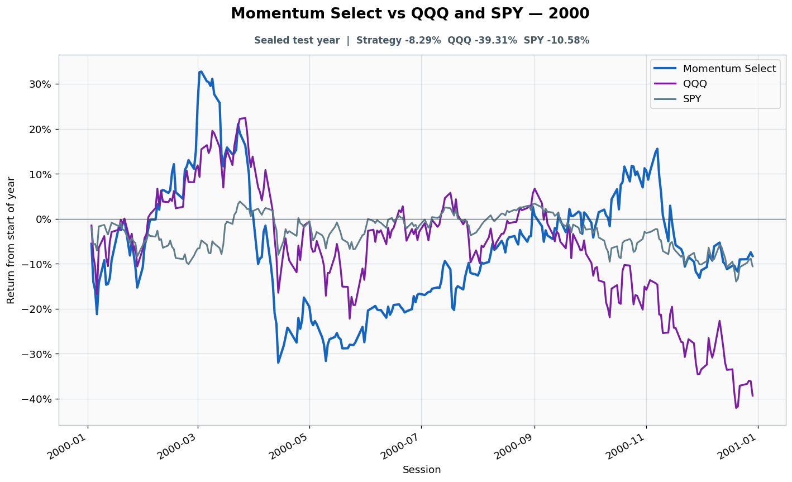

# 2000: Sealed test year

- Performance interval: **2000-01-03 through 2000-12-29** (252 sessions)
- Experimental flags: **training=no, validation=no, original sealed test=yes**
- Momentum Select return: **-8.29%**
- QQQ return: **-39.31%**
- SPY return: **-10.58%**
- Active return versus QQQ: **+31.02%**
- Weekly holding snapshots: **52**

## Files

- [`performance.csv`](performance.csv): session-level global wealth and within-year return curves.
- [`weekly_holdings.csv`](weekly_holdings.csv): last-session portfolio for every market week.

## Role note

Original sealed episode used a separate 60-stock universe; return here is continuous full-SP500 replay
