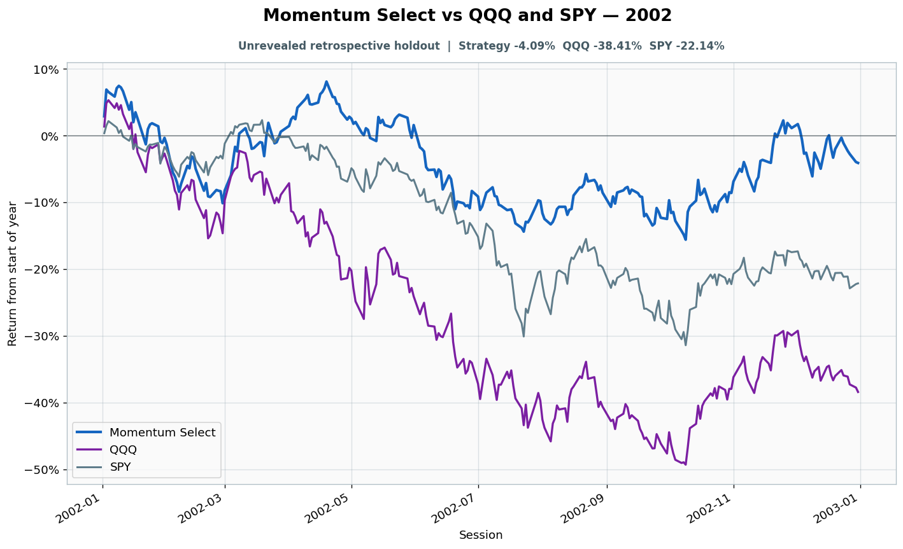

# 2002: Unrevealed retrospective holdout

- Performance interval: **2002-01-02 through 2002-12-31** (252 sessions)
- Experimental flags: **training=no, validation=no, original sealed test=no**
- Momentum Select return: **-4.09%**
- QQQ return: **-38.41%**
- SPY return: **-22.14%**
- Active return versus QQQ: **+34.32%**
- Weekly holding snapshots: **52**

## Files

- [`performance.csv`](performance.csv): session-level global wealth and within-year return curves.
- [`weekly_holdings.csv`](weekly_holdings.csv): last-session portfolio for every market week.

## Role note

No additional role note.
