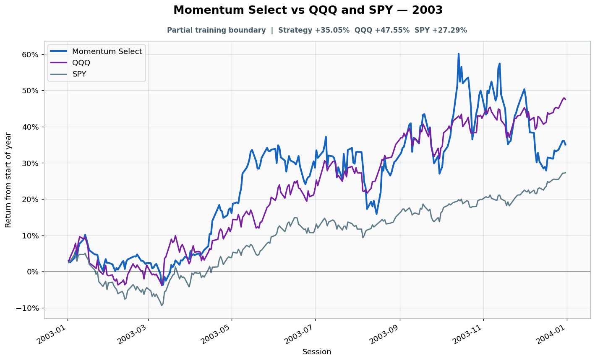

# 2003: Partial training boundary

- Performance interval: **2003-01-02 through 2003-12-31** (252 sessions)
- Experimental flags: **training=partial, validation=no, original sealed test=no**
- Momentum Select return: **+35.05%**
- QQQ return: **+47.55%**
- SPY return: **+27.29%**
- Active return versus QQQ: **-12.50%**
- Weekly holding snapshots: **52**

## Files

- [`performance.csv`](performance.csv): session-level global wealth and within-year return curves.
- [`weekly_holdings.csv`](weekly_holdings.csv): last-session portfolio for every market week.

## Role note

Only Dec 30-31 were in the visible fit panel
