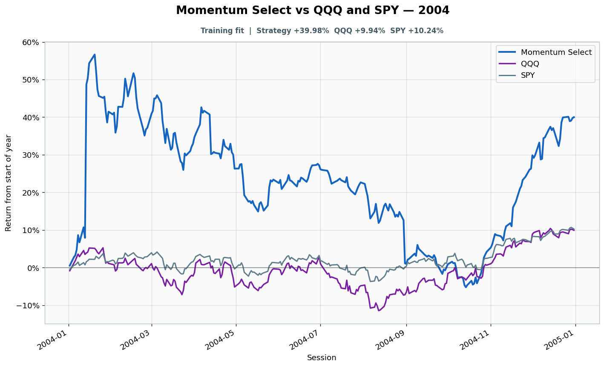

# 2004: Training fit

- Performance interval: **2004-01-02 through 2004-12-31** (252 sessions)
- Experimental flags: **training=yes, validation=no, original sealed test=no**
- Momentum Select return: **+39.98%**
- QQQ return: **+9.94%**
- SPY return: **+10.24%**
- Active return versus QQQ: **+30.05%**
- Weekly holding snapshots: **53**

## Files

- [`performance.csv`](performance.csv): session-level global wealth and within-year return curves.
- [`weekly_holdings.csv`](weekly_holdings.csv): last-session portfolio for every market week.

## Role note

Visible anonymously to candidate
