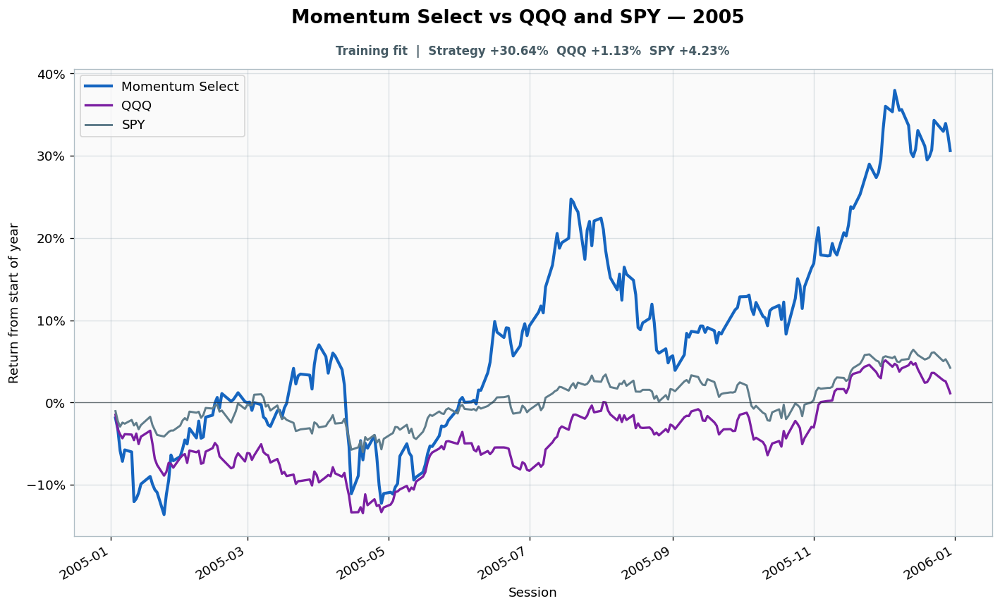

# 2005: Training fit

- Performance interval: **2005-01-03 through 2005-12-30** (252 sessions)
- Experimental flags: **training=yes, validation=no, original sealed test=no**
- Momentum Select return: **+30.64%**
- QQQ return: **+1.13%**
- SPY return: **+4.23%**
- Active return versus QQQ: **+29.50%**
- Weekly holding snapshots: **52**

## Files

- [`performance.csv`](performance.csv): session-level global wealth and within-year return curves.
- [`weekly_holdings.csv`](weekly_holdings.csv): last-session portfolio for every market week.

## Role note

Visible anonymously to candidate
