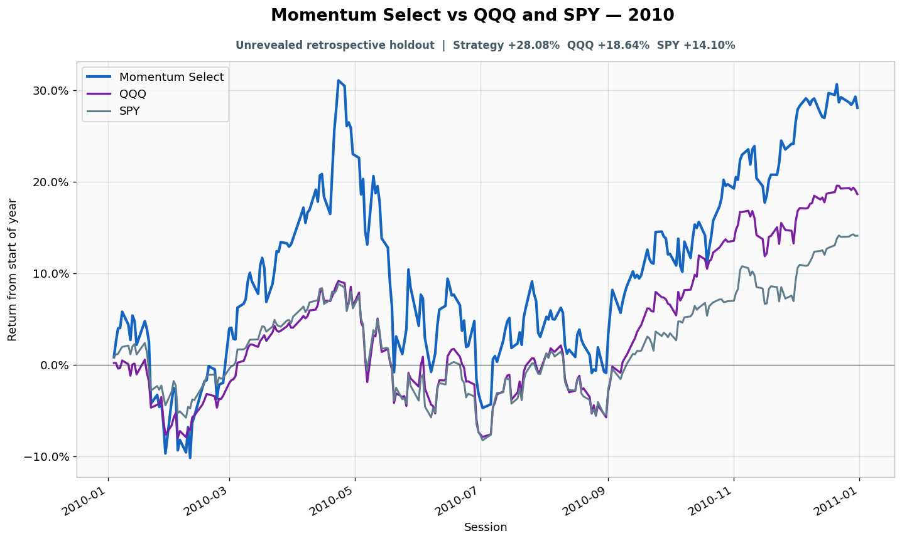

# 2010: Unrevealed retrospective holdout

- Performance interval: **2010-01-04 through 2010-12-31** (252 sessions)
- Experimental flags: **training=no, validation=no, original sealed test=no**
- Momentum Select return: **+28.08%**
- QQQ return: **+18.64%**
- SPY return: **+14.10%**
- Active return versus QQQ: **+9.44%**
- Weekly holding snapshots: **52**

## Files

- [`performance.csv`](performance.csv): session-level global wealth and within-year return curves.
- [`weekly_holdings.csv`](weekly_holdings.csv): last-session portfolio for every market week.

## Role note

No additional role note.
