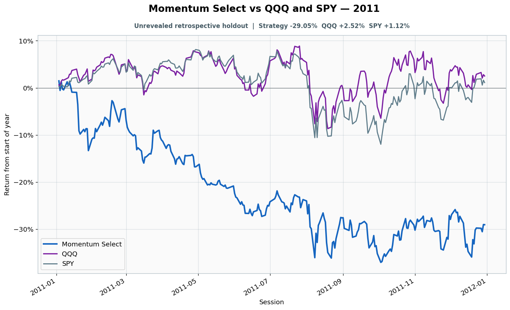

# 2011: Unrevealed retrospective holdout

- Performance interval: **2011-01-03 through 2011-12-30** (252 sessions)
- Experimental flags: **training=no, validation=no, original sealed test=no**
- Momentum Select return: **-29.05%**
- QQQ return: **+2.52%**
- SPY return: **+1.12%**
- Active return versus QQQ: **-31.57%**
- Weekly holding snapshots: **52**

## Files

- [`performance.csv`](performance.csv): session-level global wealth and within-year return curves.
- [`weekly_holdings.csv`](weekly_holdings.csv): last-session portfolio for every market week.

## Role note

No additional role note.
