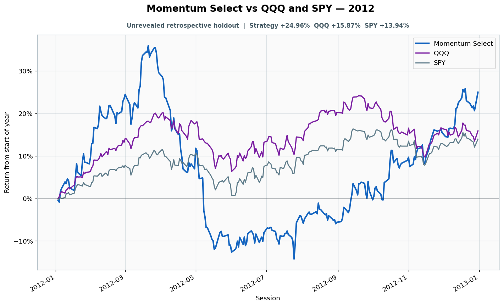

# 2012: Unrevealed retrospective holdout

- Performance interval: **2012-01-03 through 2012-12-31** (250 sessions)
- Experimental flags: **training=no, validation=no, original sealed test=no**
- Momentum Select return: **+24.96%**
- QQQ return: **+15.87%**
- SPY return: **+13.94%**
- Active return versus QQQ: **+9.09%**
- Weekly holding snapshots: **52**

## Files

- [`performance.csv`](performance.csv): session-level global wealth and within-year return curves.
- [`weekly_holdings.csv`](weekly_holdings.csv): last-session portfolio for every market week.

## Role note

No additional role note.
