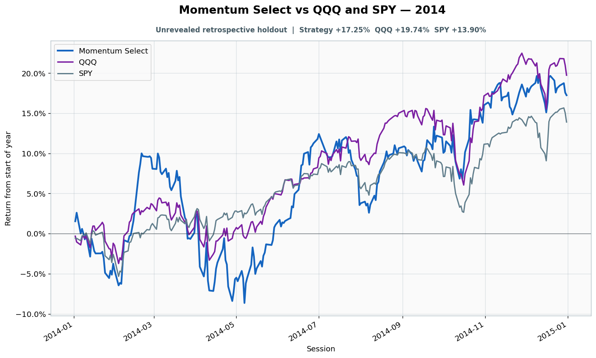

# 2014: Unrevealed retrospective holdout

- Performance interval: **2014-01-02 through 2014-12-31** (252 sessions)
- Experimental flags: **training=no, validation=no, original sealed test=no**
- Momentum Select return: **+17.25%**
- QQQ return: **+19.74%**
- SPY return: **+13.90%**
- Active return versus QQQ: **-2.49%**
- Weekly holding snapshots: **52**

## Files

- [`performance.csv`](performance.csv): session-level global wealth and within-year return curves.
- [`weekly_holdings.csv`](weekly_holdings.csv): last-session portfolio for every market week.

## Role note

No additional role note.
