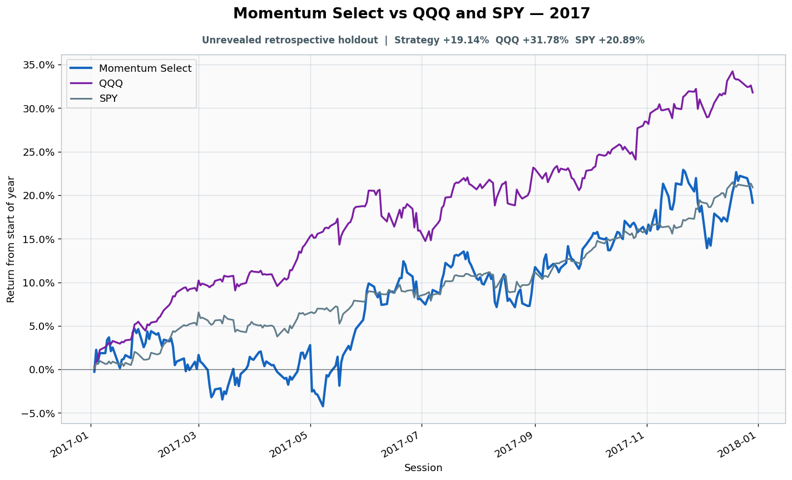

# 2017: Unrevealed retrospective holdout

- Performance interval: **2017-01-03 through 2017-12-29** (251 sessions)
- Experimental flags: **training=no, validation=no, original sealed test=no**
- Momentum Select return: **+19.14%**
- QQQ return: **+31.78%**
- SPY return: **+20.89%**
- Active return versus QQQ: **-12.65%**
- Weekly holding snapshots: **52**

## Files

- [`performance.csv`](performance.csv): session-level global wealth and within-year return curves.
- [`weekly_holdings.csv`](weekly_holdings.csv): last-session portfolio for every market week.

## Role note

No additional role note.
