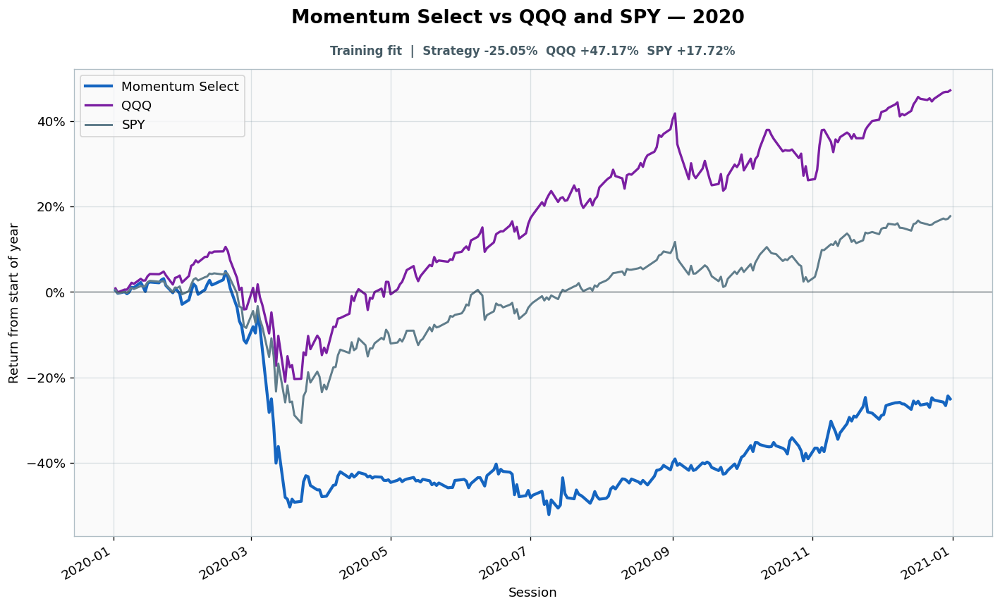

# 2020: Training fit

- Performance interval: **2020-01-02 through 2020-12-31** (253 sessions)
- Experimental flags: **training=yes, validation=no, original sealed test=no**
- Momentum Select return: **-25.05%**
- QQQ return: **+47.17%**
- SPY return: **+17.72%**
- Active return versus QQQ: **-72.21%**
- Weekly holding snapshots: **53**

## Files

- [`performance.csv`](performance.csv): session-level global wealth and within-year return curves.
- [`weekly_holdings.csv`](weekly_holdings.csv): last-session portfolio for every market week.

## Role note

Visible anonymously to candidate
