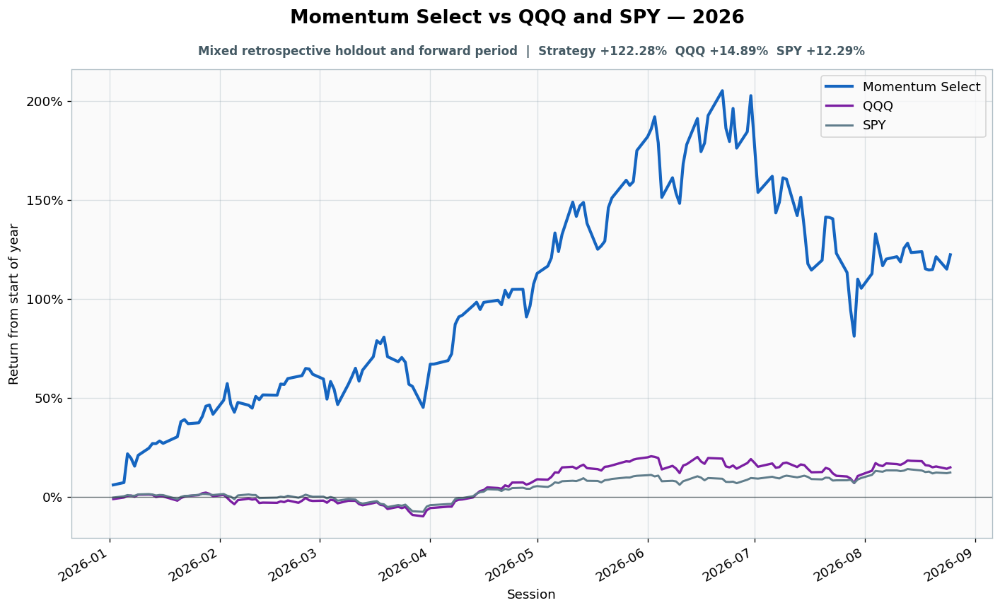

# 2026: Mixed retrospective holdout and forward period

- Performance interval: **2026-01-02 through 2026-08-25** (162 sessions)
- Experimental flags: **training=no, validation=no, original sealed test=no**
- Momentum Select return: **+122.28%**
- QQQ return: **+14.89%**
- SPY return: **+12.29%**
- Active return versus QQQ: **+107.39%**
- Weekly holding snapshots: **35**

## Files

- [`performance.csv`](performance.csv): session-level global wealth and within-year return curves.
- [`weekly_holdings.csv`](weekly_holdings.csv): last-session portfolio for every market week.

## Role note

Jan 2-Aug 7 retrospective holdout; Aug 10-25 post-freeze forward performance. Weekly holdings extend through Aug 26.
