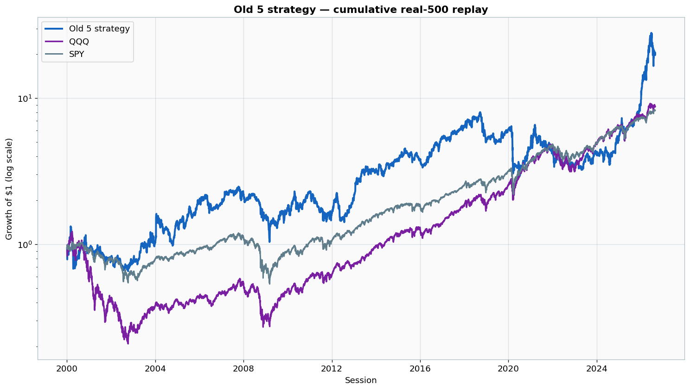
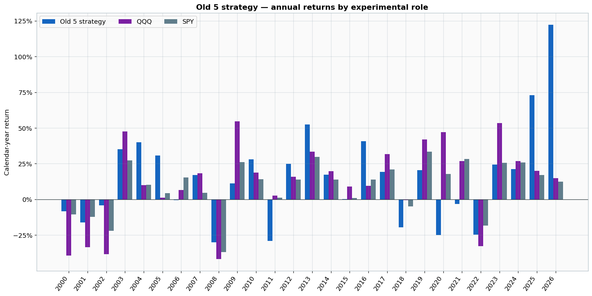

# Frozen old five-stock strategy

This directory packages the frozen old five-stock model, its audited real-S&P-500 replay, annual performance renders, and weekly holding history.

## Current regular-close instruction

Signal after the **August 26, 2026 close**, effective at the **August 27 market open**:

| Action | Stocks |
|---|---|
| Buy | AXON, CRL, IQV |
| Retain | DELL, TECH |
| Sell | HOOD, HPE, MU |
| Target | AXON 20%, CRL 20%, DELL 20%, IQV 20%, TECH 20% |
| Cash | 0% |

See signals/current_target_after_2026-08-26.json.

## Package layout

- strategy/: byte-identical frozen strategy and its MarketData interface.
- performance/: cumulative and annual performance renders.
- years/: one directory per year from 2000 through 2026, including training and validation years.
- history/weekly_holdings.csv: week-end holdings for the entire history.
- history/holding_changes.csv: every distinct holding transition.
- data/annual_performance.csv: annual returns and experimental-role labels.
- METHODOLOGY.md: execution, role, and data notes.

## Headline replay statistics through August 25, 2026

| Metric | Old 5 | QQQ | SPY |
|---|---:|---:|---:|
| Ending value of $1 | 20.41 | 8.77 | 8.24 |
| CAGR | 11.99% | 8.49% | 8.24% |
| Annualized volatility | 33.26% | 26.76% | 19.27% |
| Sharpe, 0% risk-free rate | 0.506 | 0.439 | 0.508 |
| Maximum drawdown | -63.31% | -82.96% | -55.19% |

## Reproduce and verify

    python -m pip install -r requirements.txt
    python scripts/render_reports.py
    python scripts/verify_package.py

The frozen strategy SHA-256 is a6c67728eb23ab8f236c3cb813a695e48bf1afa82905477e7aaa26b7f90b5da3.
