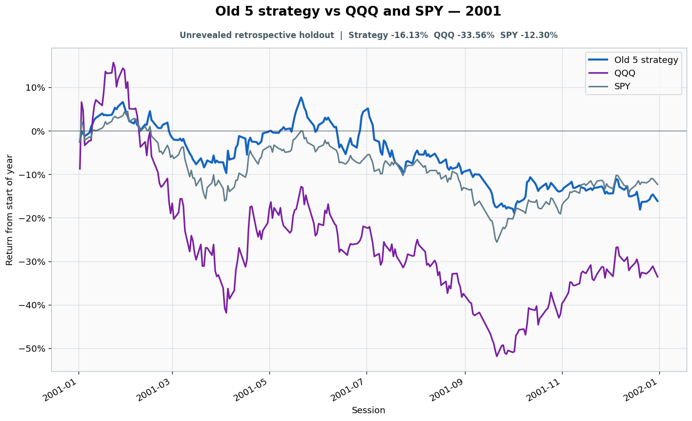

# 2001: Unrevealed retrospective holdout

- Performance interval: **2001-01-02 through 2001-12-31** (248 sessions)
- Experimental flags: **training=no, validation=no, original sealed test=no**
- Old 5 return: **-16.13%**
- QQQ return: **-33.56%**
- SPY return: **-12.30%**
- Active return versus QQQ: **+17.43%**
- Weekly holding snapshots: **52**

## Files

- [`performance.csv`](performance.csv): session-level global wealth and within-year return curves.
- [`weekly_holdings.csv`](weekly_holdings.csv): last-session portfolio for every market week.

## Role note

Jan 2 was terminal boundary for the 2000 sealed episode
