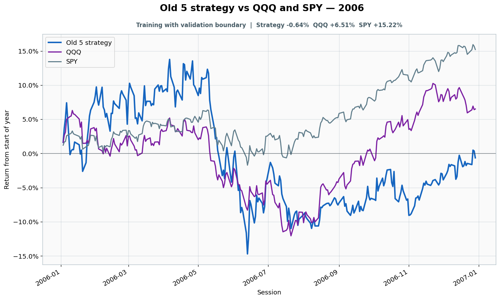

# 2006: Training with validation boundary

- Performance interval: **2006-01-03 through 2006-12-29** (251 sessions)
- Experimental flags: **training=yes, validation=partial, original sealed test=no**
- Old 5 return: **-0.64%**
- QQQ return: **+6.51%**
- SPY return: **+15.22%**
- Active return versus QQQ: **-7.15%**
- Weekly holding snapshots: **52**

## Files

- [`performance.csv`](performance.csv): session-level global wealth and within-year return curves.
- [`weekly_holdings.csv`](weekly_holdings.csv): last-session portfolio for every market week.

## Role note

Fit through Dec 28; validation/check began Dec 29
