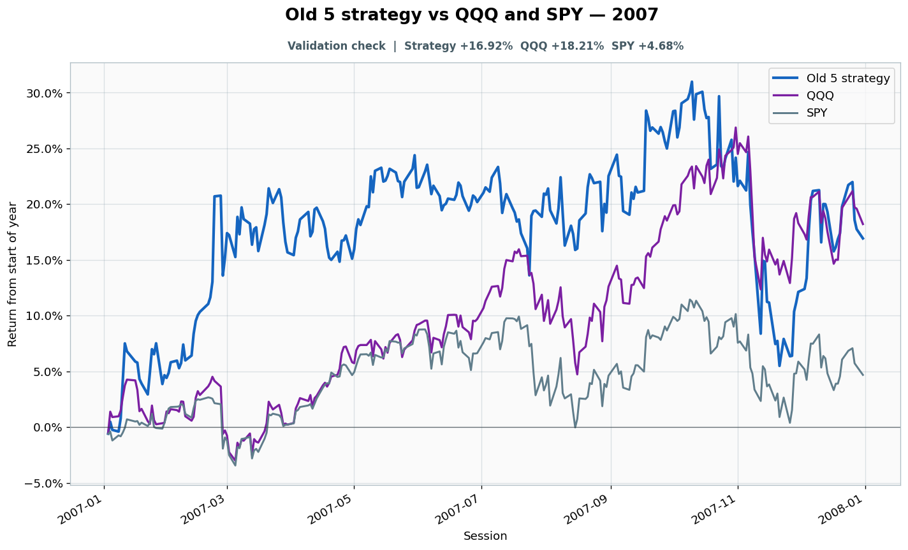

# 2007: Validation check

- Performance interval: **2007-01-03 through 2007-12-31** (251 sessions)
- Experimental flags: **training=no, validation=yes, original sealed test=no**
- Old 5 return: **+16.92%**
- QQQ return: **+18.21%**
- SPY return: **+4.68%**
- Active return versus QQQ: **-1.28%**
- Weekly holding snapshots: **52**

## Files

- [`performance.csv`](performance.csv): session-level global wealth and within-year return curves.
- [`weekly_holdings.csv`](weekly_holdings.csv): last-session portfolio for every market week.

## Role note

Visible anonymously to candidate
