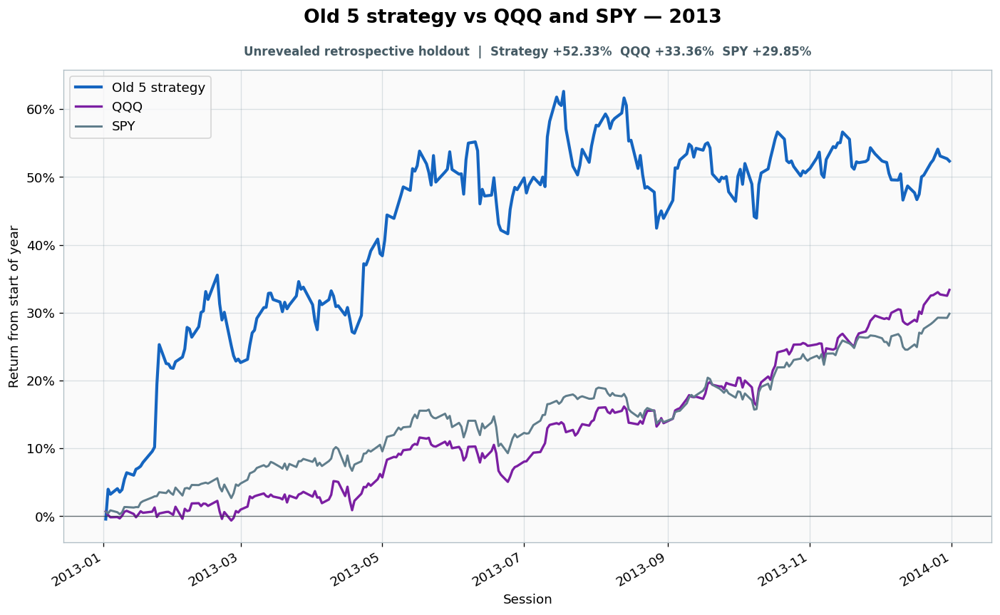

# 2013: Unrevealed retrospective holdout

- Performance interval: **2013-01-02 through 2013-12-31** (252 sessions)
- Experimental flags: **training=no, validation=no, original sealed test=no**
- Old 5 return: **+52.33%**
- QQQ return: **+33.36%**
- SPY return: **+29.85%**
- Active return versus QQQ: **+18.98%**
- Weekly holding snapshots: **52**

## Files

- [`performance.csv`](performance.csv): session-level global wealth and within-year return curves.
- [`weekly_holdings.csv`](weekly_holdings.csv): last-session portfolio for every market week.

## Role note

No additional role note.
