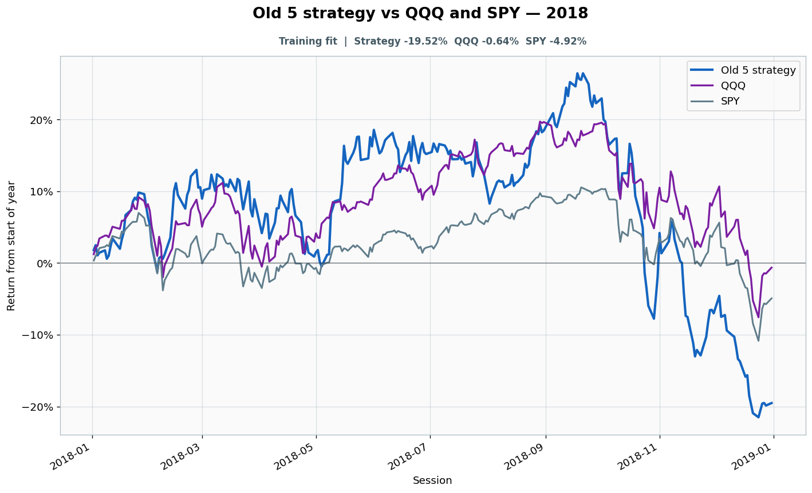

# 2018: Training fit

- Performance interval: **2018-01-02 through 2018-12-31** (251 sessions)
- Experimental flags: **training=yes, validation=no, original sealed test=no**
- Old 5 return: **-19.52%**
- QQQ return: **-0.64%**
- SPY return: **-4.92%**
- Active return versus QQQ: **-18.88%**
- Weekly holding snapshots: **52**

## Files

- [`performance.csv`](performance.csv): session-level global wealth and within-year return curves.
- [`weekly_holdings.csv`](weekly_holdings.csv): last-session portfolio for every market week.

## Role note

Visible anonymously to candidate
