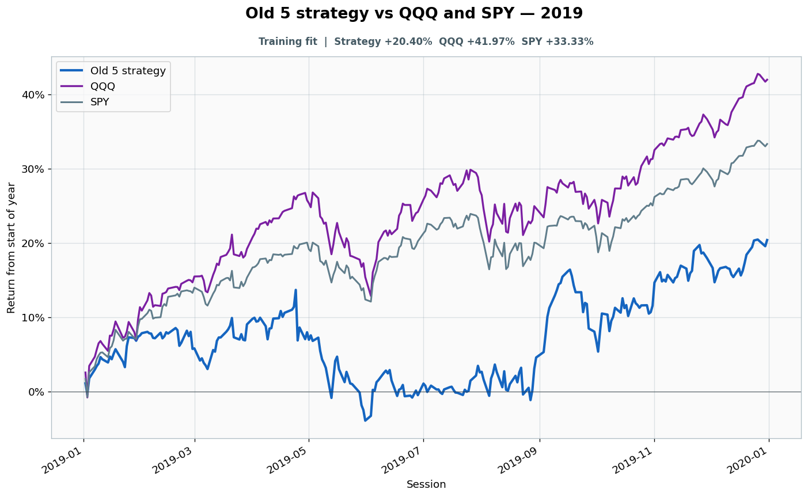

# 2019: Training fit

- Performance interval: **2019-01-02 through 2019-12-31** (252 sessions)
- Experimental flags: **training=yes, validation=no, original sealed test=no**
- Old 5 return: **+20.40%**
- QQQ return: **+41.97%**
- SPY return: **+33.33%**
- Active return versus QQQ: **-21.57%**
- Weekly holding snapshots: **52**

## Files

- [`performance.csv`](performance.csv): session-level global wealth and within-year return curves.
- [`weekly_holdings.csv`](weekly_holdings.csv): last-session portfolio for every market week.

## Role note

Visible anonymously to candidate
