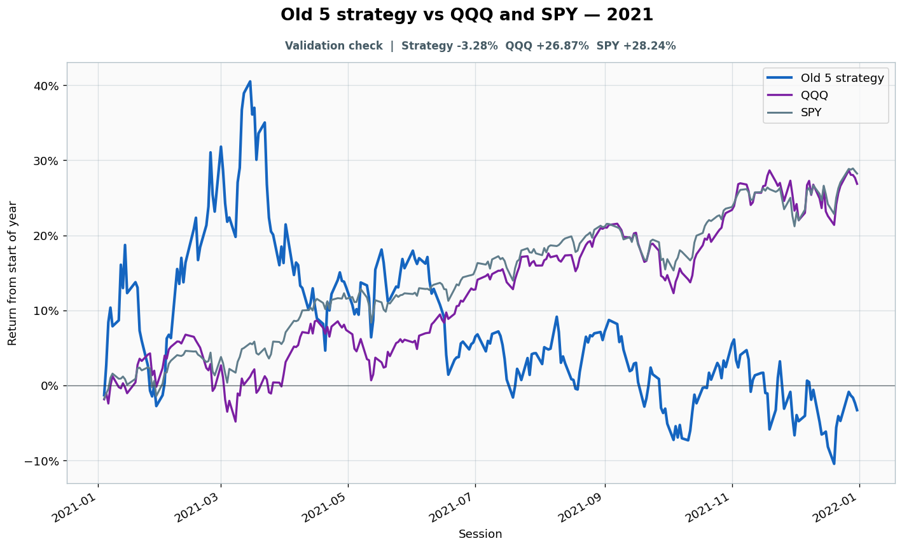

# 2021: Validation check

- Performance interval: **2021-01-04 through 2021-12-31** (252 sessions)
- Experimental flags: **training=no, validation=yes, original sealed test=no**
- Old 5 return: **-3.28%**
- QQQ return: **+26.87%**
- SPY return: **+28.24%**
- Active return versus QQQ: **-30.15%**
- Weekly holding snapshots: **52**

## Files

- [`performance.csv`](performance.csv): session-level global wealth and within-year return curves.
- [`weekly_holdings.csv`](weekly_holdings.csv): last-session portfolio for every market week.

## Role note

Visible anonymously to candidate
