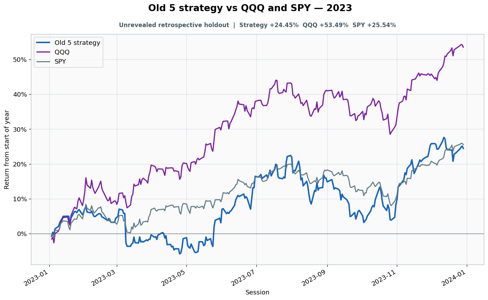

# 2023: Unrevealed retrospective holdout

- Performance interval: **2023-01-03 through 2023-12-29** (250 sessions)
- Experimental flags: **training=no, validation=no, original sealed test=no**
- Old 5 return: **+24.45%**
- QQQ return: **+53.49%**
- SPY return: **+25.54%**
- Active return versus QQQ: **-29.04%**
- Weekly holding snapshots: **52**

## Files

- [`performance.csv`](performance.csv): session-level global wealth and within-year return curves.
- [`weekly_holdings.csv`](weekly_holdings.csv): last-session portfolio for every market week.

## Role note

Jan 3 was terminal boundary for the 2022 sealed episode
